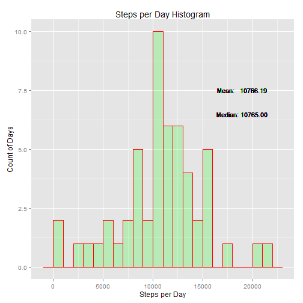
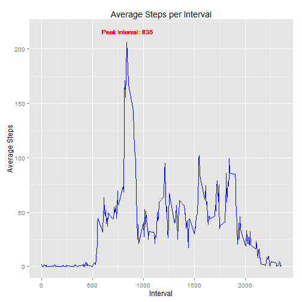
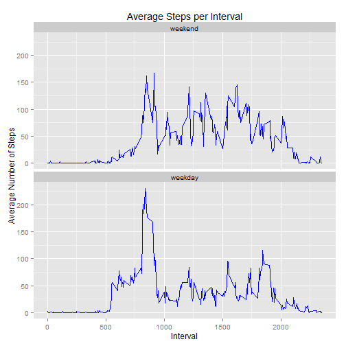

## Loading and preprocessing the data

```r
unzip('activity.zip')
steps<-read.csv('activity.csv')
```


## What is mean total number of steps taken per day?

```r
# function to display histogram, annotated with mean and median values
dailyStepHistogram <- function(df) {
    # Aggregate intervals by day to get daily totals
    stepsPerDay<-aggregate(steps ~ date, df, sum)
    
    # Calculate Mean and Median across all days
    meanDailySteps<-sprintf(mean(stepsPerDay$steps,na.rm=FALSE),fmt='%.2f')
    medianDailySteps<-sprintf(median(stepsPerDay$steps,na.rm=FALSE),fmt='%.2f')
    
    # Plot histogram: each bin=1000 steps 
    # Add text label with Mean/Median value
    library(ggplot2)
    ggplot(data=stepsPerDay, aes(steps)) + 
      geom_histogram(col="red", 
                     fill="green", 
                     alpha = .2,
                     binwidth = 1000) + 
      ggtitle("Steps per Day Histogram") +
      labs(x="Steps per Day", y="Count of Days") +
      geom_text(x=19000, y=7.5, label=paste("Mean:  ",meanDailySteps), size=4) + 
      geom_text(x=19000, y=6.5, label=paste("Median:",medianDailySteps), size=4)
}

dailyStepHistogram(steps)
```

 

## What is the average daily activity pattern?

```r
# compute interval averages (across all days)
stepsPerInterval<-aggregate(steps ~ interval, steps, mean)

# Determine interval with the biggest average step count
maxInterval<-stepsPerInterval[which.max(stepsPerInterval$steps),]

# Plot time series chart, with the highest interval annotated
ggplot(data=stepsPerInterval, aes(interval,steps)) + 
  geom_line(color="blue") +
  ggtitle("Average Steps per Interval") +
  labs(x="Interval", y="Average Steps") +
  geom_text(aes(maxInterval$interval, maxInterval$steps+10, label=(paste(" Peak Interval:", maxInterval$interval))), size=3.5, col="red")
```

 

## Imputing missing values


```r
# proportion of missing values
countIntervals<-length(steps$steps)
countMissing1<-length(which(is.na(steps$steps)))
pctMissing1<-round(countMissing1/countIntervals,2)
cat("Missing values", countMissing1, "out of", countIntervals, "[", pctMissing1, "%]")
```

```
## Missing values 2304 out of 17568 [ 0.13 %]
```

```r
# Impute missing values using the mean for the interval (which we conveniently calculated earlier)
steps2<-steps
for (i in 1:nrow(steps2)) {
    if (is.na(steps2[i,"steps"])) {
        # Look up average for this interval
        interval<-steps2[i,"interval"]
        imputed<-stepsPerInterval[(stepsPerInterval$interval == interval),"steps"]
        steps2[i,"steps"]<-imputed
    }
}
# display steps histogram for our new data.frame, using the function defined in Step 1 above
dailyStepHistogram(steps2)
```

 


Imputing missing values made very little difference to the caluclated mean and median values for total steps per day, as shown on the charts above. This is likely due to the fact that the percentage of missing values was relatively small, at 0.13% of the total, and so had little statitical impact.
The imputation did, however, have a more noticable affect on the histogram itself, rasing the number of days for several of the step ranges, especially around the median.


## Are there differences in activity patterns between weekdays and weekends?


```r
# create new factor variable - weekday_or_weekend
steps2$weekday_or_weekend <- factor(
                                    (weekdays(as.Date(steps2$date)) %in% c("Saturday","Sunday")),
                                    levels=c(TRUE,FALSE),
                                    labels=c("weekend","weekday")
                                    )

# get interval averages, for weekdays and weekends separately
stepsPerInterval2<-aggregate(steps ~ interval + weekday_or_weekend, steps2, mean)

# Plot time series charts showing average steps per intervals for weekdays versus weekends
ggplot(data=stepsPerInterval2, aes(interval,steps)) + 
  geom_line(color="blue") +
  facet_wrap(~weekday_or_weekend, ncol=1) +
  ggtitle("Average Steps per Interval") +
  labs(x="Interval", y="Average Number of Steps")
```

 


